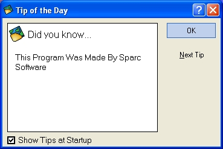



## XP Tip Of The Day \-=\- \(Update\) \-=\- Now Has More\!

### Description

I got so many good comments on the previous release that I decided to make an update. It still has the same great interface but has a little more added to it. Enjoy and vote!
 
### More Info
 

             |
---                |---
**Submitted On**   |2002-12-19 07:48:34
**By**             |[13o13](https://github.com/Planet-Source-Code/PSCIndex/blob/master/ByAuthor/13o13.md)
**Level**          |Beginner
**User Rating**    |5.0 (10 globes from 2 users)
**Compatibility**  |VB 3\.0, VB 4\.0 \(16\-bit\), VB 4\.0 \(32\-bit\), VB 5\.0, VB 6\.0
**Category**       |[Complete Applications](https://github.com/Planet-Source-Code/PSCIndex/blob/master/ByCategory/complete-applications__1-27.md)
**World**          |[Visual Basic](https://github.com/Planet-Source-Code/PSCIndex/blob/master/ByWorld/visual-basic.md)
**Archive File**   |[XP\_Tip\_Of\_15158012192002\.zip](https://github.com/Planet-Source-Code/13o13-xp-tip-of-the-day-update-now-has-more__1-41721/archive/master.zip)

